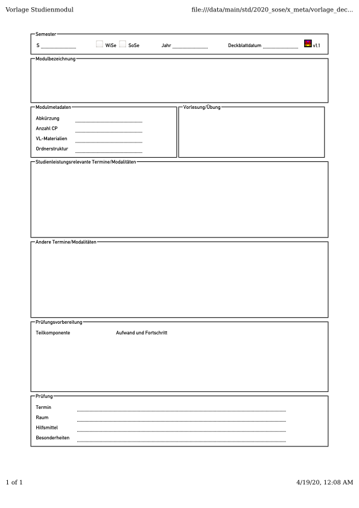
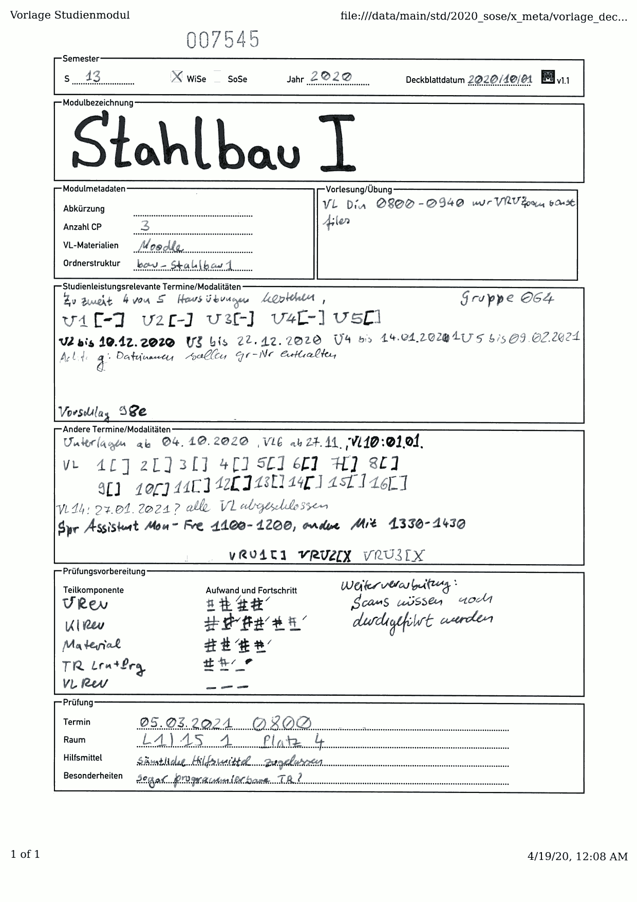
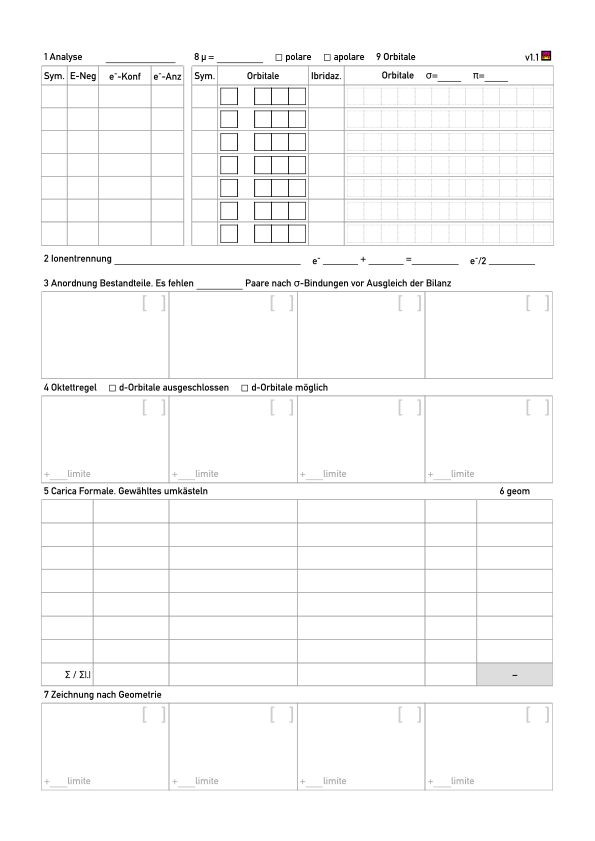
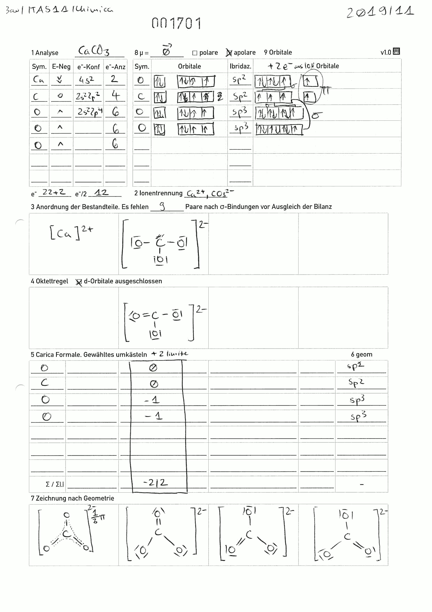
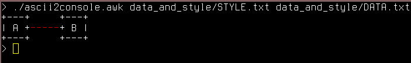

Introduction
============

When using computers, graphics and texts of all sorts can be processed. It is
also possible to re-use existing graphics and texts by means of
copying/embedding them to/within another application.

Text can often be copied losslessly as-is. When graphics or special data formats
are involved, there is usually no _simple_ means of embedding such material
into other contexts.

Hence, there are _export_ functions to create more common formats out of less
common ones often at the expense of not being properly editable anymore.
As a last resort, there is always a _screenshot_ capability that collects the
pixels as displayed on the monitor into an image file that can then be embedded
into other contexts such as documents or websites.

One of the problems with screenshots and many other export mechanisms is that
they result in a pixel-based representation (bitmap) that cannot be scaled
freely anymore. This can lead to the resulting documents looking blurry or
otherwise wrongly.

To solve some of these issues, there are _vector graphics formats_ which retain
the information about which shapes a graphic consists of. This allows graphics
to be scaled as needed and preserves a non-blurry display.

Unlike pixel-based bitmaps, the tools for processing vector graphics are known
less.

There is also an inherent issue in that there is more ambiguity in handling
shapes rather than pixels. A pixel with a color is (except for color profiles)
clearly defined. The interpretation of shapes (or even worse: texts) is,
however, open to some interpretation: Which shapes are in front of others? How
is a specified unit of measure represented on screen or paper? Etc.

Also, the complexity of vector graphics is unrelated to the image's actual size
because more shapes on a small space are more complex than fewer shapes even if
they occupy a larger drawing area.

Due to these peculiarities, it can sometimes help to do _identity
transformations_ between vector graphics: Exporting them to different formats
may change how exactly the shapes are specified and may improve or impede
rendering in target programs.

Abstract
========

This article aims at collecting some techniques for processing
_vector graphics formats_ of various sorts and origins. It is focused at
making use of existing graphics but references a few applications to create
entirely new ones from scratch, too.

Recommended Formats
===================

There are quite a few vector graphics formats out there. Some are not called
that but may serve the same purpose.

The following formats are recommended for general use:

 * SVG -- Scalable Vector Graphics
 * PDF -- Portable Document Format

Conversion between these formats is possible. One cannot generically recommend
one over the other -- it depends on what works better with the target
application.

For preserving the exact rendering of a file over time, PDF might be a slightly
better choice. If the graphics are to be edited after stored in the respective
format, SVG is often easier to handle.

Both, SVG and PDF are capable of embedding bitmap graphics. The file format
alone is thus not a safe indicator for the image being a vector graphic!

Sometimes, neither SVG nor PDF are available. In these cases, the following
alternatives should be considered:

 * HTML -- Hypertext Markup Language. This is the format used by webpages and
   it can be rendered to PDF and on many platforms. A HTML export may be a good
   starting point for further processing.
 * PS -- Post Script. Nowadays mostly superseded by PDF, a PS file can be
   converted to PDF very nicely and is hence also a viable format.
 * WMF -- Windows Metafile. This is the format to export to for embedding
   graphics in Microsoft Office applications. Stay away from EMF and WMF for
   other purposes.
 * XPS -- “Open XML Paper Specification” is a rather rarely seen vector graphics
   format that can be created on Windows systems. It is recommended to export
   XPS to PDF whenever possible, because that is easier to work with across
   multiple platforms.

Note that while SVG and PDF are the recommended vector graphics formats, when
creating any new content, you should always keep a copy in the original
format because this is the only variant that can be edited truly losslessly.

To Convert between Formats
==========================

Inkscape is a very versatile vector graphics handling tool which is also potent
for creating new graphics. It can natively edit SVG files and provides a
cairo-based as well as an own PDF import mechanism. Although it seems
counter-intuitive, the _Cairo-based Import_ often seems to work better.

## PDF to SVG

There are multiple ways to convert from an `INPUT.pdf` to an `OUTPUT.svg`:

	inkscape               -o OUTPUT.svg INPUT.pdf
	inkscape --pdf-poppler -o OUTPUT.svg INPUT.pdf
	pdf2svg INPUT.pdf OUTPUT.svg # uses cairo/poppler backend, too!

## Other Input File to SVG

Many programs have a native SVG export capability. Whenever this is available,
it is preferred. For graphics, the SVG export often offers the advantage of not
including any unnecessary whitespace.

For all file type supported by Inkscape, it is often a good choice:

	inkscape -o OUTPUT.svg INPUTFILE

For XPS files, there is `xpstosvg`. Better results can sometimes be achieved by
printing XPS files to PDF under Windows and afterwards converting to SVG.

	xpstosvg INPUT.xps OUTPUT.svg # package libgxps-utils

## SVG to PDF

	inkscape -o OUTPUT.pdf INPUT.svg
	rsvg-convert -f pdf INPUT.svg -o OUTPUT.pdf # package librsvg2-bin

You can also render SVG to PDF using web browsers.
In Firefox and Chromium you can either use the native print function or
“Print using the system dialog” for potentially different output PDFs.

Note that all web browsers will add whitespace and possibly other noise like
page headers/footers, date of printing etc. This makes this technique less
convenient than the commands suggested above.

## Text to PDF

Recall from the introduction: _Text can often be copied losslessly as-is_.

Interestingly, while this is true, it is surprisingly difficult to render
ASCII art i.e. text documents that represent a graphic by arranging characters
such that they produce an image.

Various semi-manual approaches can be taken for this purpose:

 * Open text file in a text editor and use the print capability. This often
   fails due to page boundaries not being large enough. Also, text editors
   tend to include clutter like line and page numbers which are possibly not
   wanted for this use case.
 * Copy the text into a word processor (Libreoffice Writer, MS Word or similar).
   This works but requires selecting a suitable font and configuring the page
   size. One then either needs to store the document with the correct settings
   or repeat the process for the next export.
 * Create a HTML page and render it. This process can actually be automated. See
   script `ascii2pdf.sh` in the repository associated to this page.

## Other Input File to PDF

When a PDF export is available from a program, it is a good choice. PDF exports
are often print-oriented. Hence, exported graphics often have additional
whitespace to make them fit to printable page formats.

Alternatively, _Print dialogs_ are often a means of exporting to PDF. Major
web browsers have this capability. Java programs often offer a print to PS
which can later be converted to PDF (see above).

For all file types supported by Inkscape, it can be instantiated for this
purpose:

	inkscape -o OUTPUT.pdf INPUTFILE

For HTML files, it is possible to use Web Browser's print capability or
alternatively the following command-line tool:

	wkhtmltopdf INPUT.html OUTPUT.pdf

For PS files, Ghostscript is often a good alternative to Inkscape:

	ps2pdf INPUT.ps OUTPUT.pdf # package ghostscript

For XPS files, there is also an utility:

	xpstopdf INPUT.xps OUTPUT.pdf # package libgxps-utils

## Input File to WMF

Recommended format for embedding into Microsoft Office Documents.

	inkscape               -o OUTPUT.wmf INPUT.svg # if INPUT is SVG
	inkscape --pdf-poppler -o OUTPUT.wmf INPUT.pdf # if INPUT is PDF
	inkscape               -o OUTPUT.wmf INPUT.pdf # if INPUT is PDF

## Other Formats for Vector Graphics in Microsoft Office Documents

MS Office supports two other vector formats besides WMF: EMF and EPS.

While EMF often works worse than WMF (although it is _enhanced_ meta file?), the
EPS capability _can_ be a viable choice under very specific circumstances. It
requires a registry hack to work:
<https://support.microsoft.com/en-us/topic/security-settings-for-graphic-filters-for-microsoft-office-365-microsoft-office-2016-microsoft-office-2013-microsoft-office-2010-and-the-2007-microsoft-office-system-8b690e9c-b309-c0ff-1949-e28d04be4c19>

Then, one can use EPS files (which can be converted from PS) inside MS Office
documents.

Conversion for EPS (rarely useful for other purposes) can be done with inkscape
or Ghostscript:

	inkscape -o OUTPUT.eps INPUTFILE
	ps2eps INPUT.ps OUTPUT.eps # package ps2eps

To perform Identity Transformations
===================================

An identity transformation takes one input and produces the same output format.
As explained under _Introduction_, not all vector graphics representations are
equal. Hence, an identity transformation can still produce varying outputs.

The following ways have been found to sometimes be effective (substitute `->` by
one of the conversion steps from before):

	SVG -> PDF -> SVG
	PDF -> SVG -> PDF
	PDF -> PS -> PDF
	SVG -> PS -> PDF -> SVG # usually not a good idea

The very versatile `gs` (Ghostscript) command can be used as a direct identity
transformation without intermediate conversion into a different format. It still
produces an output different from the input file.

The script `pdf_reduce_gs.sh` (provided in the repository) makes use of a `gs`
command to attempt to reduce the original file size as follows:

	gs -dBATCH -dNOPAUSE -dNOCACHE -sProcessColorModel=DeviceRGB \
		-dNOOUTERSAVE -sOutputFile=OUTPUT.pdf -dPDFSETTINGS=/prepress \
		-dMonoImageResolution=600 -r150 -dSAFER \
		-dMaxInlineImageSize=16384 -dDetectDuplicateImages \
		-sDEVICE=pdfwrite INPUT.pdf

Variations of this command with fewer arguments may also work, e.g. try:

	gs -dBATCH -dNOPAUSE -dNOCACHE -dNOOUTERSAVE -sOutputFile=OUTPUT.pdf \
		-dSAFER -sDEVICE=pdfwrite INPUT.pdf

There is also a tool called `svgcleaner` for an SVG -> SVG identity
transformation. I have not tried it out yet, but it can be found here:
<https://github.com/RazrFalcon/svgcleaner>.

To Reassemble existing Graphics
===============================

This section collects various means of re-using existing graphics in a range
from simple operations like rotation to complex operations like creating a
Table of Contents.

## Cropping, Rotating, Concatenating, Splitting

For many automated processing tasks, PDF inputs work best. The following tools
can be used entirely from the command-line: `pdfcrop`, `pdfjam` and `pdftk`.

To cut off whitespace from a PDF, use `pdfcrop` to produce file `FILE-crop.pdf`:

	pdfcrop FILE.pdf                # package texlive-extra-utils

In case you need to cut out part of a PDF (and not simply the whitespace
around the page), there are two interactive GUI tools for this:

 * `gpdfx-ng`. Homepage: <https://github.com/yishilin14/gpdfx-ng>,
   Compilation Instructions: <https://github.com/m7a/bp-gpdfx>
 * `pdfscissors`. See <https://github.com/abdullah-mazed/pdfscissors>.

I often use `gpdfx-ng` and very rarely `pdfscissors` because the programs behave
a little differently:

 * `gpdfx` extracts data only from a single page and automatically crops it
   with `pdfcrop`.
 * `pdfscissors` always operates on all pages and does not reduce the actual
   data size of the PDF. You should thus not include its output directly into
   e.g. a LaTeX document because that will cause an unnecessary amount of data
   to be stored. Also, it is possible for interested persons to recover the
   original (uncropped) document.

To rotate a PDF, use `pdftk` or `pdfjam`

	pdftk IN.pdf rotate -east output OUT.pdf  # package pdftk
	pdfjam --angle 270 -o OUT.pdf IN.pdf      # package texlive-extra-utils

These two commands are not exactly equal: `pdftk` does not add whitespace
whereas `pdfjam` always outputs a page of a configurable _paper size_ in a
configurable orientation, e.g. to use A4 and landscape mode, amend the call
as follows:

	pdfjam --angle 270 -o OUT.pdf --paper a4paper --landscape IN.pdf

Also, while `pdfjam` syntax is rather intuitive with position independent long
and short options, `pdftk` is arcane: In the depicted call, the position of
arguments is mandatory, as is the keyword `output`. Notation `-east` is not just
“parameter east”, but rather “the entire page range” (`-`) concatenated with the
direction to rotate (`east`).

To concatenate PDFs, the tools can be used as follows:

	pdfjam -o OUT.pdf IN1.pdf IN2.pdf
	pdfjam -o OUT.pdf IN1.pdf 1-2 IN2.pdf 4,9
	pdftk IN1.pdf IN2.pdf cat output OUT.pdf
	pdftk A=IN1.pdf B=IN2.pdf cat A1-2 B4,9 output OUT.pdf

The commands can be explained as follows:

 * Notation `1-2` indicates a page range (from page 1 to page 2 both inclusive)
 * Notation `4,9` indicates a list of pages (include page 4 and 9 only)
 * The `pdftk` syntax with `A=` and `B=` assigns these letters to the input
   files and allows them to be combined arbitrarily after the `cat`. It is
   also possible to repeat input files by e.g. specifying `A1-2` multiple times
   there.

Here, too, `pdftk` retains the input's paper formats allowing the concatenation
of small and large pages into a single document. While this can be hard for
PDF readers to process properly it _is_ useful for including large drawings
into regular documents.

Splitting PDFs with `pdfjam` works as follows:

	pdfjam -o OUT1.pdf IN.pdf 1
	pdfjam -o OUT2.pdf IN.pdf 2

I.e. by selecting each page once and creating a different output file for each
choice, one can split a PDF into one PDF for each page. This is a little
tedious, though. `pdftk` can do this automatically and in a single call:

	pdftk IN.pdf burst

This will create `pg_0001.pdf`, `pg_0002.pdf` and so on for each of the input
document's pages and unlike the `pdfjam` approach suggested above it will retain
the paper sizes from the original document.

Both, `pdfjam` and `pdftk` are very versatile. The following two subsections
detail some special features of these tools.

## Advanced use of `pdfjam`: Nup and Scale Operations

`pdfjam` can be used to place multiple pages on one using the `--nup NxM`
option. Here,

 * `N` is the horizontal number of pages to put beside each other and
 * `M` is the vertical number of pages to put above each other

A typical means to place four slides of a presentation on one page for a
printout may be using a command like the following:

	pdfjam -o print.pdf --nup 2x2 --landscape presentation.pdf

It is important to add the `--landscape` parameter here because otherwise the
(typically landscape) slides would be allocated a portrait-format slot on the
2x2 grid that would not be used to its full extent.

Another option worth noting is the `--scale` option: It scales the inputs
by the given factor before assembling them for the output. You can scale down
a page to 90% as follows:

	pdfjam -o OUT.pdf --scale 0.9 --paper a4paper IN.pdf

`--scale` can be combined with `--nup` to achieve print layouts that have enough
whitespace for being printed on typical non-borderless office printers. For that
purpose, scales between 0.95 and 0.98 tend to work well.

A command with 0.95 scaling and 2x2 slides on a page could be as follows:

	pdfjam -o print.pdf --scale 0.95 --nup 2x2 --landscape presentation.pdf

Note that this not only adds space at the output page border but also between
the slides on the page. If the space between the slides is unwanted, perform
a two-pass operation as follows:

	pdfjam -o tmp.pdf --nup 2x2 --landscape presentation.pdf
	pdfjam -o print.pdf --scale 0.95 --landscape tmp.pdf

This way, whitespace will only be added to the edges of the actual printed
page, and not between the slides. Of course, by adding a `--scale` option to
the first operation, too, you can fine-tune the space between slides and to the
border of the paper.

## Advanced use of `pdftk`: Shuffle, Remove XMP and Stamp Operations

`shuffle`
:   Shuffle assembles a single PDF from multiple inputs by taking all first
    pages, then all second pages, then all third pages etc. after each other.
    Say, you have a PDF with all “left-hand” pages and another PDF with all
    “right-hand” pages. Then you can use this feature to bring them back in
    order.

`drop_xmp`
:   This can be used to remove metadata. XMP metadata may reveal sensitive
    information such as the user name of the person who exported the document
    or the actual software version in use for the export.

`stamp` / `background`
:   This can be used to overlay/underlay a specific PDF above/below an existent
    one. This feature is nice for adding page numbers to documents which
    otherwise don't have them or to add a common logo onto all of the pages.

### Example Script for Background Stamping

This shows the interaction of burst/background/output to edit all pages of a
PDF individually and add a background (taken from `fglayer.pdf`) to all pages
taken from `merged.pdf` producing the output file `merged2.pdf`.

~~~{.bash}
# Split into multiple files with prefix by number
pdftk fglayer.pdf burst output split_intermediate/%04d.pdf
pdftk merged.pdf  burst output split_intermediate/%04d_bg.pdf
# Process Add `bg` to `fglayer` PDFs and produce result pdfs (`_rs`)
for i in split_intermediate/????.pdf; do \
	fn="$(echo "$i" | cut -d. -f 1 | cut -d/ -f 2)"
	pdftk "$i" background "split_intermediate/${fn}_bg.pdf" output \
					"split_intermediate/${fn}_rs.pdf" &
done
wait
# Concatenate together result PDFs
pdftk $(echo split_intermediate/????_rs.pdf | sort) output merged2.pdf
~~~

This approach works well if e.g. `merged.pdf` is the input and `fglayer.pdf` is
a file consisting solely of info to be stamped onto the data from `merged.pdf`.

See subdirectory `example_background` for a LaTeX file to produce a
`fglayer.pdf` file.

The core of the LaTeX implementation of this approach looks as follows:

~~~{.tex}
\begin{document}
\let\cleardoublepage\relax
\newcommand{\macursec}[0]{}
\pagestyle{fancy}
\fancypagestyle{plain}{\pagestyle{fancy}}
\setlength{\fboxsep}{0pt}
\newcommand\mamark{\hspace{1cm}\fbox{\setlength{\fboxsep}{3pt}%
	\colorbox{white}{\begin{minipage}[T]{10mm}%
	\includegraphics[height=8mm]{masysmaicon}\end{minipage}%
	\begin{minipage}[T]{20cm}\flushleft
	{\macursec{}} | \textbf{\thepage}\end{minipage}}}}
\renewcommand{\headrulewidth}{0pt}
\lhead[]{}
\chead[]{}
\rhead[]{}
\lfoot[\mamark]{\mamark}
\cfoot[]{}
\rfoot[]{}
\newcommand\mapart[1]{\addcontentsline{toc}{section}{#1}%
	\renewcommand{\macursec}[0]{#1}\clearpage\setcounter{page}{1}}
%-------------------------------------------------------------------------------

\mapart{Section 1 slides}
\multido{}{44}{\vphantom{x}\clearpage}

\mapart{Section 2 slides}
\multido{}{44}{\vphantom{x}\clearpage}

%-------------------------------------------------------------------------------
\end{document}
~~~

## Creating Large Graphics out of Small Ones

Re-assembling multiple small graphics into a large whole is only an automatic
operation in the simple cases like considered with the previously described
command: `pdfjam --nup NxM --scale SCALE`. In cases a more fine-grained control
of the actual composition is needed, a manual approach should be considered.

Multiple tools can be instantiated for the purpose

Libreoffice Draw (SVG -> PDF)
:   Although “office”-style products are sometimes frowned upon by the experts,
    LO Draw fully supports arranging images in a free-style fashion. As it can
    work with SVG files, vector graphics can be processed as inputs and as it
    can export to PDF, it can retain the vector quality for the actual output
    composition. LO Draw has been found to very rarely mess with the actual
    graphics' contents and does not produce overly large PDF outputs. Working
    interactively with this tool can be slow, though, because rendering
    performance is a little on the slow side. In this case, it can help to
    disable the on-the-fly rendering of images: There used to be a checkbox
    buried in the menus somewhere to do this, but it could not be located in
    Libreoffice Draw 7.0.4.2 anymore? Finally, the implicit format conversion
    from SVG to PDF may be problematic for some graphics and use cases.

Inkscape (SVG -- SVG)
:   Inkscape was already mentioned for conversion between formats. It can be
    used to compose graphics, too. When it works, it gives a greater flexibility
    and better placement precision compared to LO Draw: When graphics are
    reasonably coded, they can sometimes even be broken into components using
    the “ungroup” feature or by preparing the SVG code by hand. This can be
    used to e.g. remove components from otherwise hard-to-edit PDF graphics.
    The usual approach when using Inkscape is to _import_ the graphics that are
    to be composed. While it is often possible to open a given SVG or PDF in
    Inkscape, it is sometimes hard to _copy_ graphics from one window to the
    other without heavily distorting the contents. It can help to pre-convert
    the graphics of interest to SVG or even do some identity transformations
    _before_ opening the respective graphic in order to have it in a more
    copy-friendly state. Overall, for complex compositions of graphics from
    multiple sources, Inkscape is not my first choice.

LaTeX/TikZ (PDF -- PDF)
:   If the workflow is more pdf-centric and a conversion to SVG should be
    avoided or if other factors favor the use of a TeX backend, LaTeX can be
    a viable choice. Using TikZ it becomes possible to place nodes that may
    themselves contain entire graphics e.g. by using `\\includegraphics` inside
    as a node's content.

HTML (SVG -- PDF)
:   Under special circumstances it might become sensible to encode the
    composition of graphics in HTML and export that back into a graphics
    format like PDF. Although frowned-upon by HTML designers, HTML `<table>`
    elements provide for a flexible means of organizing graphics that can be
    hard to achieve in any of the other programs. HTML cannot include PDF
    directly, hence inputs should come as SVG files. On the output side, browser
    print functions and `wkhtmltopdf` produce a PDF. This means a conversion
    similar to the LO Draw case is included.

## Annotate with Defined Coordinates

Sometimes there is an existing graphic which should be drawn into at defined
coordinates. Here, _defined coordinates_ refers to the fact that the graphics'
scale is not only qualitative but that the position of points and lines actually
represents a value.

In a paper-based workflow it is possible to draw to scale using geometry
triangles and other drawing auxiliary tools. In all-digital scenarios where
the vector properties should be retained (rather than printing something out
and scanning it back in), it is a little more complicated.

There are multiple basic techniques that can be used in such cases:

### With Arbitrary Scales

In case the original graphic already indicates some scale in form of numbers in
a grid, count the number of divisions. Then create the vector graphic that is
going to be adjusted to the scale with the same number of divisions and scale it
to fit the predefined grid.

The same technique can be used when there is a sort of axis labelling by marking
one point on each of the axes at a defined number and then marking the same
point in the new graphic to be created (e.g. the one representing the data to be
drawn into the graph). Afterwards, the new graphic can be scaled to fit the
defined limits by making the common points identical between the two graphics.

Useful tools in this regard are the following:

 * Inkscape -- used for scaling and copying tasks
 * Geogebra -- used for plotting graphs. By putting a (potentially bitmap)
   copy of the target background into Geogebra's coordinate system, one can
   obtain common points for the purpose
 * Libreoffice Calc -- LO charts can be adjusted in various ways including the
   possibility to fine-tune the number of units for grids. This can enable the
   transformation into a common scale, too.

### With Defined Scales

In case the original graphic indicates a common scale like e.g. 1:50 or
such, it is possible to create the new graphic of interest in the same scale
and then copy them over each other. This will avoid re-scaling but some
common programs do not support output at defined lengths.

Useful tools for this are the following:

 * SVG -- SVG graphics can be specified with actual sizes in millimeters.
   With careful GUI use, Inkscape can do this to some extent, too.
 * LaTeX+TikZ -- can create graphics to scale, too.

## Add Table of Contents

To achieve a similar effect to the approach described under _Example Script for
Background Stamping_ before, one can also use LaTeX' `includepdf` feature and in
the process optionally generate a Table of Contents, too.

In `example_inclduestamp_toc/includestamp.tex` an example LaTeX code is provided
for the purpose. In the example, `empty100.pdf` serves as a substitute for any
real PDF document that one would like to annotate using this approach.

At the core, the code looks as follows:

~~~{.tex}
\begin{document}
\let\cleardoublepage\relax
\newcommand{\macursec}[0]{}
\pagestyle{fancy}
\fancypagestyle{plain}{\pagestyle{fancy}}
\setlength{\fboxsep}{0pt}
\newcommand\mamark{
	\begin{tabular}{|p{7cm}p{6.5cm}p{3cm}|}
	\hline
	\cellcolor{white} Some Topic&
		\cellcolor{white} \cmd{info@masysma.net}, 13.08.2021&
		\cellcolor{white} Page \thepage/\pageref{LastPage}\\
	\cellcolor{white} More Info&
		\multicolumn{2}{l|}{\cellcolor{white}\textbf{\macursec}}\\
	\hline
	\end{tabular}
}
\renewcommand{\headrulewidth}{0pt}
\lhead[\mamark]{\mamark}
\chead[]{}
\rhead[]{}
\lfoot[]{}
\cfoot[]{}
\rfoot[]{}
\newcommand\mapart[1]{\addcontentsline{toc}{section}{#1}%
				\renewcommand{\macursec}[0]{#1}\clearpage}

\tableofcontents % optional

\mapart{Long Part Description 1}
\includepdf[pagecommand={},pages=1-30]{empty100}

\mapart{Long Part Description 2}
\includepdf[pagecommand={},pages=31-37]{empty100}

\end{document}
~~~

### Drawing on the Page Background with TikZ

Above approach can be combined with TikZ to draw directly on the page or its
background. The following code contains some handy excerpts illustrating the
approach. There is currently no compilable example in the repository
about this technique, though.

~~~{.tex}
\usetikzlibrary{backgrounds}
% ...
\begin{document}
% ...

\pagestyle{fancy}
\fancypagestyle{plain}{\pagestyle{fancy}}
\newcommand\maextracmds{}
\newcommand\matikzinfobox{
	\node[anchor=north west,xshift=0.5cm,yshift=-0.75cm] at
		(current page.north west) {%
			\begin{tabular}{|l|l|}
			\hline
			\footnotesize AAAAA & \footnotesize \pagemark \\
			\hline
			\multicolumn{2}{|c|}{\scriptsize BBBBB}\\
			\hline
			\end{tabular}
		};
	\maextracmds
}
\newcommand\mamark{\begin{tikzpicture}[remember picture,overlay]
	\matikzinfobox
\end{tikzpicture}}
\renewcommand{\headrulewidth}{0pt}
\lhead[\mamark]{\mamark}
\chead[]{}
\rhead[]{}
\lfoot[]{}
\cfoot[]{}
\rfoot[]{}

% ...
\includepdfmerge[pagecommand={\pagestyle{fancy}}]{...pdf file here...}

% ...

\begin{tikzpicture}[remember picture,overlay]
	\begin{scope}[on background layer]
		\node[xshift=5mm,anchor=west] at (current page.west) {\dots};
	\end{scope}
	\matikzinfobox
\end{tikzpicture}
~~~

To create new Graphics
======================

There are countless applications to create vector graphics. Almost any program
that has a _print_ function can be used for the purpose. The following shows
some selected tools that have been found to be useful for creating new
vector graphics.

Xournal (package `xournal`)
:   This program can be used for PDF annotation but can also create
    standalone/empty documents. It is best for annotation purposes and cases
    where the actual coordinates and scales of drawing do not matter.

(L)O Suite (package `libreoffice`)
:   Office suites provide multiple formats of documents that can all be exported
    to vector graphics. This is not strictly limited to _Libreoffice Draw_,
    _Calc_ and _Writer_ but also applies to the MS Office variants. Many people
    seem to be able to create incredibly complex graphics all in _Powerpoint_
    so that may contain some secret simplicity for entering graphics. I
    personally do not find any of the office suites to be overly intuitive to
    use correctly.

Dia (package `dia`)
:   This diagram editor can be used to quickly create flowcharts and other
    boxes-and-lines-based charts. It also supports a variety of special
    templates from which specialized diagrams can be created e.g.
    Entity-Relationship diagrams. While Dia supports UML, entering UML
    is rather clumsy and has some annoying caveats. It is e.g. impossible to
    resize a class diagram to an arbitrary size of choice which effectively
    makes it impossible to achieve an UML layout where parts are all grid-aligned
    and connected by mostly straight lines in 90° angles. Dia's PDF export
    creates multiple pages by default and the diagram components are very large
    by default making small diagrams already span multiple pages. The SVG
    export works fine, though.

UMLet
:   This is (by the name) an UML tool but given that it can draw generic
    rectangles and generic arrows combined with colors and transparency can be
    used for a lot of charting tasks. It needs some guessing and searching to
    find out about the syntax of formatting -- some of it is markdown-inspired,
    e.g. `*bold*`, some other things are UMLet's own way of doing things.
    Having overcome this hurdles, it is much more efficient to create an UML
    diagram in UMLet rather than Dia. The default UMLet line thickness and font
    are sometimes ill-suited for printing them directly. If UMLet is to be used
    in a print-centric workflow, consider printing out some sample diagrams
    first and find out what to change for acceptable printing quality -- it may
    mostly be a matter of font choice and line thickness. UMLet is particularly
    well-suited in case an efficient combination of text and GUI-based
    approaches for diagram creation is sought and where the diagrams of
    interest are UML or generic boxes and lines. Anything that becomes complex
    (think of gradients, shadows, weird effects) is better done in other
    applications.

Inkscape (package `inkscape`)
:   This SVG editor provides a lot of flexibility in creating arbitrary
    vector-based shapes with colors. It excels at tasks where there is a clear
    mapping to SVG primitives. Inkscape's font handling and object moving and
    resizing features are less convoluted than other programs'.

draw.io
:   Although the name suggests differently, this is neither a drawing-centric
    nor a webapp-only program. It is a fully-featured diagram drawing tool that
    conceptually combines Inkscape and Dia elements together with a more
    intuitive GUI interface. Note that I do not have any first-hand experience
    with this tool yet, but I consider adding it to my toolbox.

HTML + CSS
:   Although it seems a little counter-intuitive, HTML + CSS can be quite viable
    a choice for creating _printed forms_. This is due to the fact that
    styling and sizing empty HTML tables and `<legend>` elements overall is
    pretty straight-forward especially if some HTML and CSS2 are already known.
    It even works to (a relative) scale! After that one can just use the
    browser's _print_ function to obtain a perfectly styled form. Of course,
    this is less well-suited for general purpose graphics but similar to
    LibreOffice Writer or LaTeX can be quite viable for document-like graphics
    purposes.

LaTeX+TikZ
:   Although a command-line program with text input may not be the most
    intuitive choice for creating graphics, LaTeX and TikZ provide a powerful
    toolbox for creating highly complex graphics with perfect typesetting.
    TikZ is a powerful diagram framework that exceeds the capabilities of
    Dia and Inkscape taken together. Its syntax is _arcane_ though. The
    documentation with over 1300 pages is rather comprehensive and shows a lot
    of helpful examples (cf. <https://tikz.dev/> and
    <https://ctan.org/pkg/pgf?lang=en>). Unlike other markup languages, TikZ
    provides primtives (like e.g. draw lines between points and such) and
    advanced concepts (like e.g. named nodes whose distances may be specified
    relative to each other up to entire tree structures generated from just
    specifying the nodes and their nesting. This allows for solving a variety
    of graphics tasks _if you know how to go about them_. The learning curve
    is steep and there does not seem to be a defined way to learn it beyond some
    beginners understanding. Maybe it would help to trying to use TikZ for all
    one's graphics needs for a defined long period of time, but whenever there
    is no Stackoverflow entry nor an exactly matching example in the
    documentation, one can get lost in TikZ world...

## Examples for HTML and CSS based Forms

This section demonstrates the use of HTML and CSS to design useful vector
graphics forms. The following forms are mostly in German but the point is less
the content (it may even be incorrect) but more the _form design_ that can be
created with a few HTML and CSS instructions.

The final graphics was obtained by using Firefox' print function to create the
PDF.

File `example_vdstdmod.xhtml` contains a form for organizing a study module.
Below pictures show a blank and a filled-out version:

File `example_molekuelformular.xhtml` contains a form that was used to train
for a chemistry exam in Italy. Again, there is the blank version and a
filled-out version. Note that the blank version is v1.1 (a later revision)
whereas the filled-out version corresponds to an older design.

## ASCII Art

The next section explains rendering text-based graphics. There are some
tools that simplify the creation of such graphics and enhance their versatility.
These solutions to vector graphics are definitely a niche. However,
restricting graphics to ASCII art limits complexity in an interesting sense that
can result in increased quality whenever this forces designers to remove much
of the extra bells and eye-candy and instead strongly focus on the actual
content and wisely use the limited number of design elements provided by the
ASCII or Unicode charsets.

Ditaa and Ditaa2EPS
:   The underdog among all of the tools presented here: Ditaa is a program that
    takes ASCII-art graphics and creates bitmaps out of them. The separately
    downloadable Ditaa2EPS does the same but produces an EPS (i.e. vector)
    output. Ditaa uses some heuristics (and a specific syntax) to determine
    the actual output formatting which is intended to allow fine-tuning the
    output graphic while retaining ASCII readability. The output quality after
    sending an arbitrary ASCII art graphics to Ditaa can be hit-or-miss but if
    graphics are designed with Ditaa in mind upfront, it becomes possible to
    create graphics that are portable from text consoles to presentations or
    styled text documents and websites.

DrawIt! (`drawit.vim`)
:   This VIM plugin (<https://www.vim.org/scripts/script.php?script_id=40>)
    provides an interesting means to draw ASCII art in the VIM text editor.
    It is useful in combination with template files for filling specific page
    layouts as to limit the drawing space to extents that can be reasonably
    printed on paper. The input method takes some getting used to but is much
    faster than assembling the ASCII art in a regular text editor especially
    if large boxes are to be drawn. See [templates(32)](../32/templates.xhtml)
    for a package that contains empty ASCII art pages for A3 and A4 print
    sizes. See the online vimhelp for usage instructions:
    <http://www.drchip.org/astronaut/vim/doc/DrawIt.txt.html>.
    Download the plugin from the author's home page here:
    <http://www.drchip.org/astronaut/vim/vbafiles/DrawIt.vba.gz>.

To convert Console Text to Graphics
===================================

Sometimes, it can be beneficial to convert text into graphics. This is
especially useful to preserve colors and formatting. Most GUI applications
support “print” operations which can produce a PDF or similar. For console-based
applications, such options are not always available.

## Using the “print” function of Console Applications

In `vim`, you can print the document using `:ha > print.ps` which produces a
postscript document.

Additionally, `:TOhtml` can be used to generate an HTML representation of the
currently opened file including syntax highlighting. For many printing
purposes it may make sense to invert the color scheme by setting
`:set bg=light` first.

## From Terminal To Text

If anything is displayed in the terminal, it can most often be selected by the
mouse and copied. Alternatively, it is often possible to redirect programs'
output into text files.

Whenever control sequences are contained, this can become difficult. There are
then two major options that can be considered:

 1. Tools from package `colorized-logs` can be used to strip ANSI Escape
    Sequences or convert colorized terminal output to colorized HTML which may
    enable further processing.
 2. Terminal multiplexers like `tmux` and `screen` allow selecting a portion
    of the window contents and pasting them again. To copy the output of a
    currently running program in `tmux`, follow these steps:
     * Make sure the output you want to copy is displayed in tmux and the tmux
       window size matches what you want to be the output width of the text.
     * Press [CTRL]-[B] then [[] (opening bracket) then jump to the beginning of
       the area of interest with [H] [J] [K] [L]
     * Press [V] to enter visual mode.
     * Select lines with [J]
     * Press enter once everything of interest is selected.
     * Enter a command like `cat > /tmp/file.txt`
     * Press [CTRL]-[B] then []] (closing bracket) to paste the contents
     * Press [CTRL]-[D] to close input to `/tmp/file.txt`
     * The plain-text copy of the output should now be in `/tmp/file.txt`.

## Printing ASCII Art

Graphics can not only be created in popular graphics formats such as SVG, PDF
or PNG but also in form of plain text files as “ASCII art” i.e. graphics made
of ASCII (or nowadays Unicode) characters. Such graphics are useful in that they
can be processed on text-based terminals and embedded into text files of any
kind e.g. within program source codes. Although they are not vector graphics in
the usual sense, they can still be scaled to almost arbitrary sizes by choosing
a larger font size.

Problems with ASCII art occur whenever the output of interest is intended to be
colored. There are _ANSI Escape Sequences_ which can be used to colorize the
output on a Terminal. There do not seem to be any good ANSI Escape
Sequence-capable ASCII art editors, though.

This repository provides a small set of scripts to aid in the process of
creating colorized ASCII art. The workflow is as follows:

 1. Create monochrome ASCII art in a text file (let's call it `DATA.txt`)
 2. Copy `DATA.txt` to `STYLE.txt` then make it a _stylesheet_
 3. Render the colorized version using scripts `ascii2console.awk` or
    `ascii2pdf.sh`.

The idea behind a _stylesheet_ here is that it has the same form as the
actual graphics but characters are not displayed but rather describe the color
of the text to display.

Here is a simple example.

	DATA.txt
	+---+     +---+
	| A +-----+ B |
	+---+     +---+
	STYLE.txt
	+---+     +---+
	|   +rrrrr+   |
	+---+     +---+

Here, the `r` characters in the stylesheet advise the scripts to color that part
of the original graphics in red. I.e. the output could look as follows:

The following letters are supported to indicate colors:

Letters  Colors         ANSI         HTML
-------  -------------  -----------  --------------
g, G     green          1/32m        00aa00/00cc00
w, k     white          1;37m/1;30m  777777/ignored
y, Y     yellow         1/33m        999900/cccc00
p, P     pink, magenta  1/35m        990099/ff00ff
r, R     red            1/31m        900000/ff0000
b, B     blue           1/34m        000090/0000ff
c, C     cyan           1/36m        008080/00aaaa

In addition to its support for stylesheets, script `ascii2pdf.sh` also supports
specifying the output page size and selects a sane font by default (if
installed).

As an additional feature, `ascii2pdf.sh` supports specifying custom color
letters and overriding the defaults by processing any lines at the end of the
stylesheet as CSS code to add to an intermediate XHTML output page.

To render to Bitmap
===================

Sometimes a vector graphic is available but a bitmap (i.e. pixels) are needed.
Depending on the source format, there are multiple ways to render vector
graphics.

## ImageMagick

The `convert` program provided by ImageMagick is easy to use on the command
line:

	convert -density 300 INPUT.pdf OUTPUT.png
	convert -density 300 INPUT.svg OUTPUT.png

Parameter `-density` specifies the target resolution in DPI. The given example
(300) may be well suited for a medium to high-quality output. Reduce this
parameter to reduce output file size at the expense of quality.

Due to security concerns, it may be necessary to enable this feature first, cf:
<https://askubuntu.com/questions/1081895/trouble-with-batch-conversion-of-png-to-pdf-using-convert>

## RSVG (convert from SVG)

The `rsvg-convert` utility can be used for SVG to PDF conversion but also as
a means to render SVG to bitmap:

	rsvg-convert --dpi-x 300 --dpi-y 300 -f png INPUT.svg -o OUTPUT.png

Similar to the _ImageMagick_ varaint, the intended output resolution can be
specified. Check the output of `rsvg-convert --help` for a listing of other
means to specify the output sizes.

## wkhtmltoimage (convert from HTML)

	wkhtmltoimage -f png INPUT.html OUTPUT.png

Similar to `wkhtmltopdf`, this tool can be used to convert HTML pages to bitmap
exports. Like the Firefox screenshot function, this allows the conversion of
pages which do not fit the screen and hence cannot be captured in their entirety
by means of a generic screenshot function.

## GUI Applications

In addition to above mentioned command-line programs, these are some noteworthy
GUI programs with bitmap export capabilities:

 * Inkscape
 * GIMP
 * Firefox -- This browser is worth noting because it provides a screenshot
   function that can take screenshots larger than the viewport/screen size and
   hence be used for many SVG and HTML to bitmap export tasks.

Conclusion
==========

If anything, remember the following tools from this article:

 * `gpdfx` -- PDF extraction tool.
 * `rsvg-convert` -- tool to convert SVG to PDF.
 * `pdf2svg` -- tool to convert from PDF to SVG.

From the convoluted complexity of all of the vector graphics operations it is
pretty obvious why there are still so many blurred screenshots in place of
actual vector graphics!

Future Directions
=================

There are some additional tricks worth explaining. Most notably, my peculiar
LaTeX+Maxima integration is probably worth explaining in a dedicated article.

See Also
========

 * [programming_fonts(37)](../37/programming_fonts.xhtml) provides some
   information about useful _Programming Fonts_ that may as well be used for
   rendering ASCII art.
 * [conf-cli(32)](../32/conf-cli.xhtml) provides script `svg2pdf` as
   an alias for `rsvg-convert`.
 * [templates(32)](../32/templates.xhtml) provides ASCII art frame templates if
   to use for cases where it is intended to print the resulting drawing to a
   defined paper size like A3 or A4.
 * Build instructions for an `mdvl-umlet` package:
   <https://github.com/m7a/lp-umlet>
 * Packaging instructions for an `mdvl-pdfscissors` package:
   <https://github.com/m7a/bp-pdfscissors>
